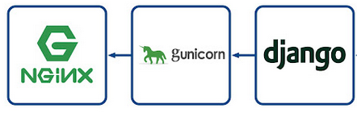

# django-nginx-gunicorn

This project is for deploying a production-ready Django project using Nginx and Gunicorn.
Running a local server of Django is not a recommended way in production because it is only a development environment with
lots of limitations, but not a production server. Therefore, in order to run Django efficiently in a production
environment we need a web server and a reverse proxy. In this regard, Gunicorn and Nginx are
 highly recommended for deployment.

__Gunicorn:__ The Gunicorn "Green Unicorn" is a Python Web Server Gateway Interface HTTP server. The Gunicorn server is 
broadly compatible with a number of web frameworks, simply implemented, light on server resources and fairly fast.

__Nginx__: Nginx is a web server that can also be used as a reverse proxy, load balancer, mail proxy and HTTP cache.

All materials of this project are dockerized in a single container for a simpler deployment.

### How to Build
> docker build -t helloworld_django .

### How to Run
> docker run --name helloworld_django -p 80:80 helloworld_django

After running the container, A simple Django project will be run using Nginx and Gunicorn that shows a "Hello World"
statement on the following address:

> http://127.0.0.1:80
